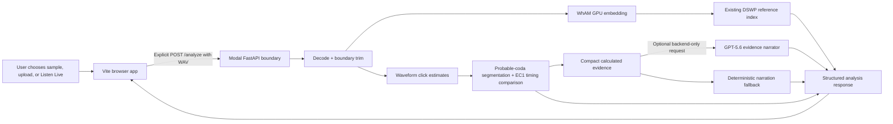
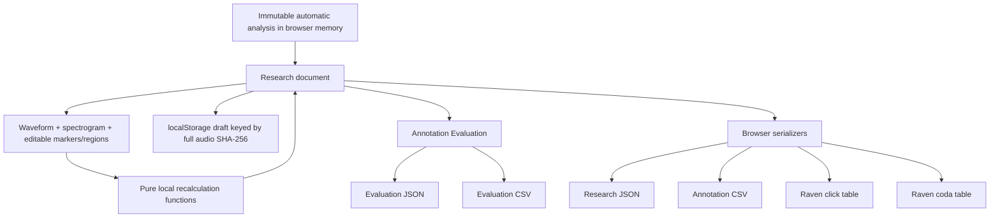
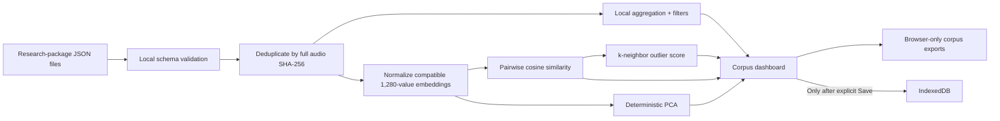
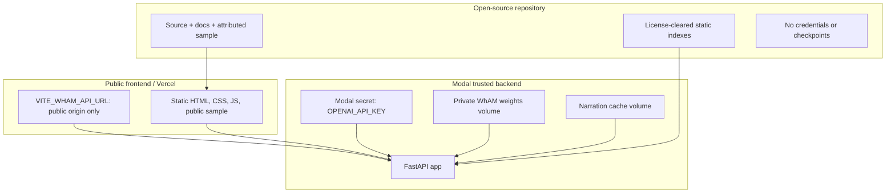
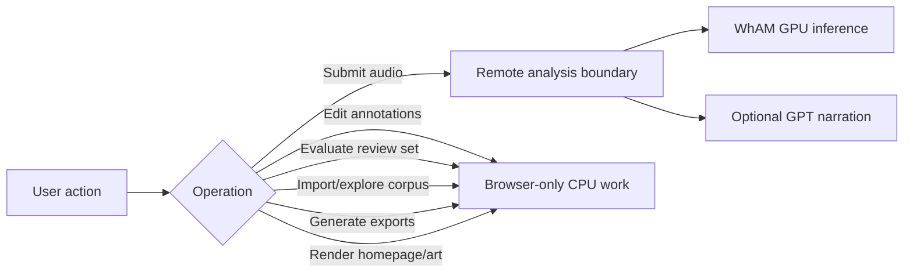

# Architecture and trust boundaries

## Browser to analysis service

Only an explicit analysis action sends audio. The backend temporarily writes decoded/trimmed WAV files for processing and removes them in `finally` blocks. Deployed provider logs, volumes, and retention settings remain operational responsibilities.

## Research annotation and export

Editing, evaluation, and downloads do not call the backend. Automatic values are retained separately from human-corrected review values.

## Corpus Explorer local-only flow

Imported packages are not uploaded. IndexedDB persistence is opt-in and can be deleted from the interface.

## Secrets and deployment boundaries

`OPENAI_API_KEY` is referenced only by backend code and must never use a `VITE_` prefix. Modal/Vercel/GitHub/Hugging Face credentials belong in provider secret stores, not files.

## Paid versus browser-only operations

The first branch can incur infrastructure/model-provider cost. The second branch must remain local and requires no Modal, GPU, WhAM, OpenAI, or paid API call.

## Frontend lifecycle

The public controls render independently of the Three.js chunk. An intersection-aware loader starts the ocean scene lazily. The renderer caps pixel ratio, lowers complexity on small screens, pauses its frame loop when the document is hidden, honors reduced motion, shows a static fallback without WebGL, and disposes geometries, materials, render targets, listeners, observers, and animation frames during teardown.

## Runtime data inventory

| Data | Location | Network behavior |
|---|---|---|
| Selected/recorded audio | Browser memory, then explicit analysis request | Sent only to configured `/analyze` endpoint after user action. |
| Backend temporary WAV | Ephemeral container filesystem | Local to analysis container; deleted after request. |
| WhAM weights | Private Modal volume | Never sent to browser or stored in Git. |
| Narration evidence | Backend compact JSON | Optional OpenAI request; excludes raw audio, embedding, filename, and researcher notes. |
| Research draft | Browser `localStorage` | Never uploaded by annotation actions. |
| Imported corpus | Browser memory | Never uploaded. |
| Saved corpus | Browser IndexedDB after explicit save | Never uploaded by Corpus Explorer. |
| Exports | Browser-generated downloads | Never uploaded by export actions. |
