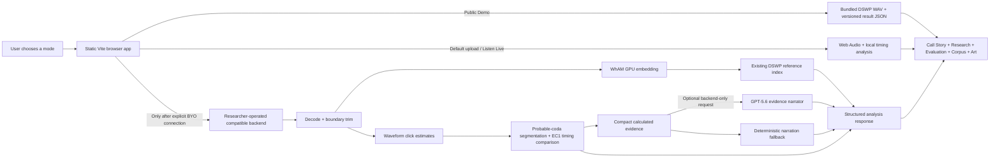
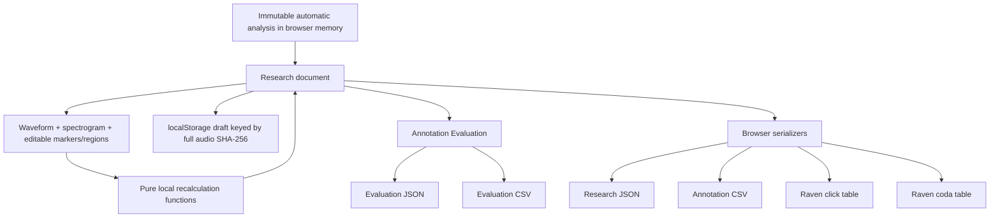
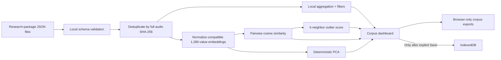
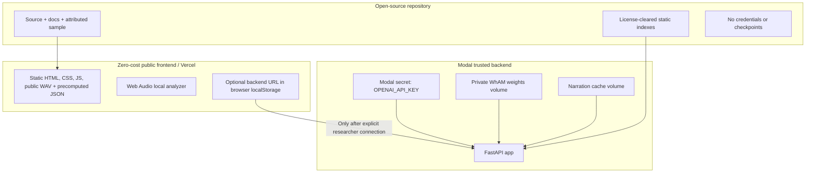
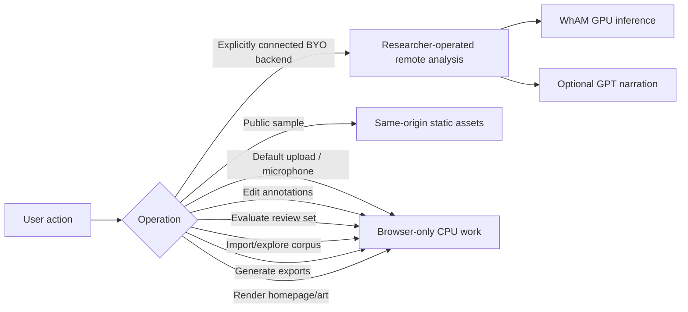
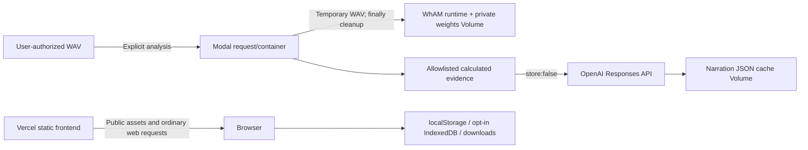

# Architecture and trust boundaries

## Public static and optional analysis flows

The public sample and browser-only paths make no analysis API request. Only an
explicitly configured researcher backend causes later analysis actions to send
audio. The backend temporarily writes decoded/trimmed WAV files for processing
and removes them in `finally` blocks. Provider logs, volumes, costs, licenses,
and retention settings remain the researcher/operator’s responsibility.

The GPT branch receives the return value of `compact_evidence(...)`, an explicit whitelist containing calculated coda timing, cautious published-family comparisons, and bounded role evidence. It does not receive raw audio, full WhAM embeddings, filenames, or research annotations. The Responses call sets `store=False`.

## Research annotation and export

Editing, evaluation, and downloads do not call the backend. Automatic values are retained separately from human-corrected review values.

## Corpus Explorer local-only flow

Imported packages are not uploaded. IndexedDB persistence is opt-in and can be deleted from the interface.

## Secrets and deployment boundaries

`OPENAI_API_KEY` is referenced only by backend code and must never use a `VITE_` prefix. Modal/Vercel/GitHub/Hugging Face credentials belong in provider secret stores, not files.

## Paid versus browser-only operations

Only the researcher-operated branch can incur infrastructure/model-provider
cost. The static and local branches require no Modal, GPU, WhAM, OpenAI, or
paid API call.

## Frontend lifecycle

The public controls render independently of the Three.js chunk. An intersection-aware loader starts the ocean scene lazily. The renderer caps pixel ratio, lowers complexity on small screens, pauses its frame loop when the document is hidden, honors reduced motion, shows a static fallback without WebGL, and disposes geometries, materials, render targets, listeners, observers, and animation frames during teardown.

## Runtime data inventory

| Data | Location | Network behavior |
|---|---|---|
| Selected/recorded audio | Browser memory | Stays local by default; sent only after an explicit BYO backend connection and later analysis action. |
| BYO backend URL | Browser localStorage | Never compiled into the site; no API key is requested. |
| Backend temporary WAV | Ephemeral container filesystem | Local to analysis container; deleted after request. |
| WhAM weights | Private Modal volume | Never sent to browser or stored in Git. |
| Narration evidence | Backend compact JSON | Optional OpenAI request; excludes raw audio, embedding, filename, and researcher notes. |
| Research draft | Browser `localStorage` | Never uploaded by annotation actions. |
| Imported corpus | Browser memory | Never uploaded. |
| Saved corpus | Browser IndexedDB after explicit save | Never uploaded by Corpus Explorer. |
| Exports | Browser-generated downloads | Never uploaded by export actions. |

## Provider and retention boundary

Verified code behavior, provider policy, and production-dashboard configuration are separate:

- **Verified code:** explicit audio submission, temporary-file cleanup, compact GPT evidence, `store=False`, backend-only key access, browser-only research/evaluation/corpus calculations, localStorage drafts, and opt-in IndexedDB.
- **Provider policy:** current public Modal, OpenAI, and Vercel documentation summarized in [PRIVACY.md](PRIVACY.md).
- **Manual production verification:** actual plan/retention/logging, data-control, analytics, access, and deletion settings in each provider dashboard.

The persistent narration Volume stores a minimal JSON envelope keyed by a hash-derived cache key, not audio or evidence inputs. Entries are valid for 30 days; expired entries are rejected, and a daily authenticated scheduled function removes expired/invalid envelopes. A separate authenticated Modal function deletes one hash-addressed entry and is not exposed through FastAPI. See [DATA_RETENTION.md](DATA_RETENTION.md).

## WhAM runtime boundary

The production embedding path loads only the private `codec.pth` and `coarse.pth` checkpoints. WaveBeat is not constructed, configured, or supplied a checkpoint; its unused upstream installer declaration is removed before VampNet installation. The public FastAPI application has only `POST /embed` and `POST /analyze` and does not mount or serve `/weights`. See [WHAM_WEIGHTS.md](WHAM_WEIGHTS.md).
