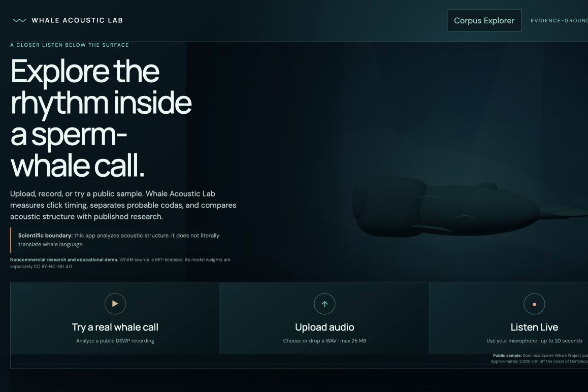
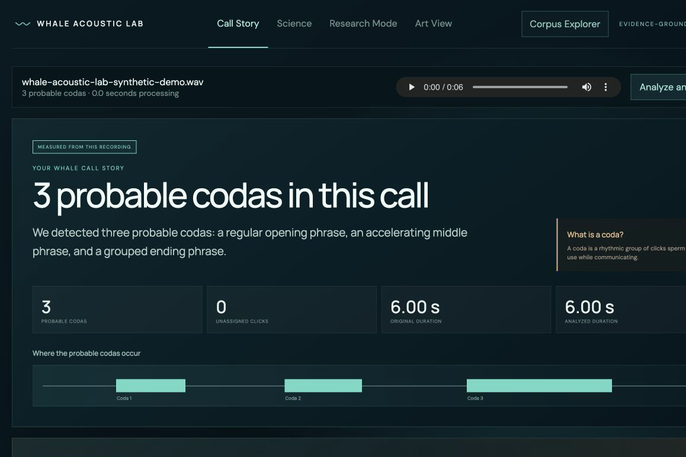
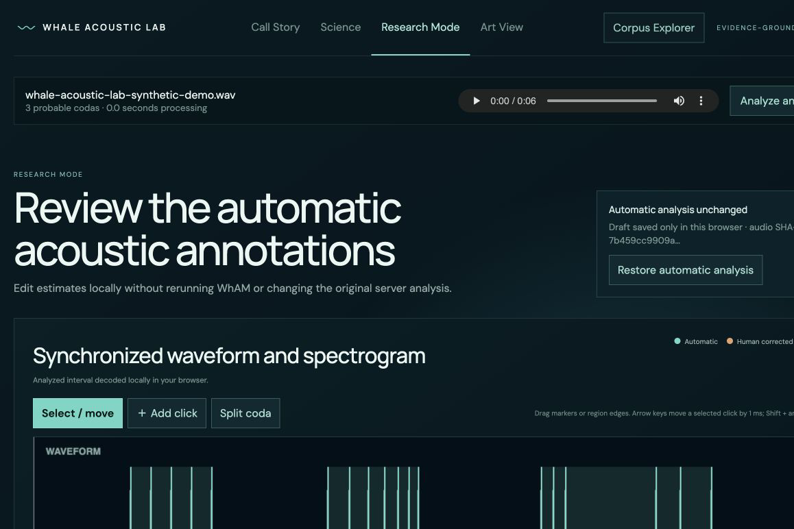
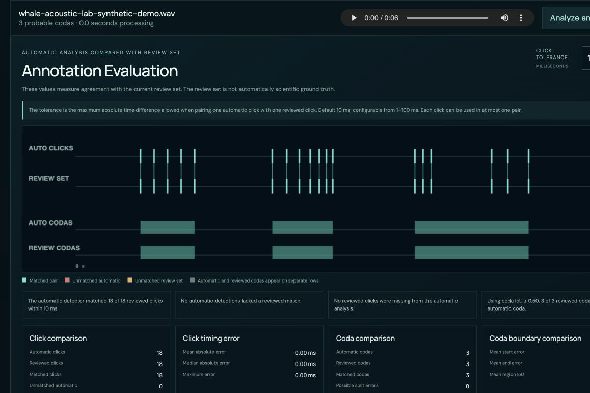
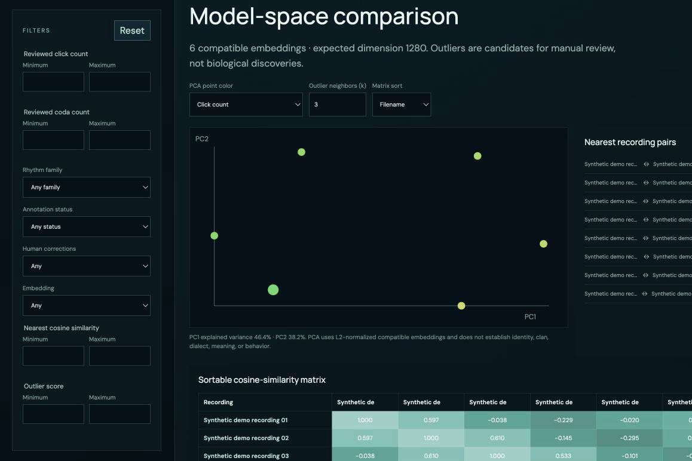

# Whale Acoustic Lab

Whale Acoustic Lab is an evidence-bounded product and researcher workspace for exploring sperm-whale recordings. Its public site is a static, zero-cost experience: an attributed sample has a checked-in precomputed result, while uploads and microphone recordings use transparent browser-only timing analysis. Researchers may explicitly connect their own compatible backend for full WhAM features.

[Open the live zero-cost demo](https://sabbivikas.github.io/whale-acoustic-lab/)

> Scientists have not literally translated sperm-whale language. This project analyzes acoustic structure. Its family matches, conversational-role hypotheses, model-space neighbors, and musical analogies are limited comparisons—not statements of meaning, identity, intent, emotion, clan, or dialect.

Original Whale Acoustic Lab code is copyright © 2026 Vikas Sabbi and released
under the MIT License. Development used AI coding assistance; AI systems are
tools, not copyright owners or project contributors. Third-party data, derived
indexes, fonts, model source, and model weights retain their separate licenses.
See [COPYRIGHT.md](COPYRIGHT.md), [CONTRIBUTORS.md](CONTRIBUTORS.md), and
[THIRD_PARTY_LICENSES.md](THIRD_PARTY_LICENSES.md).

## Product experience

The public experience provides three immediate paths:

- **Try a real whale call** using an attributed DSWP sample and its versioned precomputed analysis.
- **Upload audio** for local browser-only analysis.
- **Listen Live** for local browser-only analysis; microphone permission is requested only after that action.

The three operating modes are:

1. **Public Demo:** loads the bundled DSWP WAV and
   `frontend/src/data/dswp-1-analysis.v1.json`. That result was produced from
   checked-in audio, an existing stored embedding, existing indexes, local
   click/coda/rhythm code, and deterministic narration. It is labeled
   “Precomputed public sample.”
2. **Browser-Only Local Analysis:** decodes user audio with Web Audio and
   calculates click estimates, ICIs, probable-coda segmentation, EC1 timing
   comparisons, rhythm measurements, waveform, spectrogram, and deterministic
   explanations on the device. It makes no analysis API request and does not
   create a WhAM embedding, acoustic neighbors, or GPT narration.
3. **Bring Your Own Backend:** an optional Advanced setting accepts a
   compatible HTTPS backend URL and stores it only in that browser. Whale
   Acoustic Lab never requests or stores its API key. The researcher is
   responsible for cost, access control, licenses, and data handling.

After analysis, the interface presents:

- a measured call story and probable-coda sequence;
- click timestamps, inter-click intervals (ICIs), rhythm regularity, pace direction, and grouping;
- nearest published EC1 rhythm families with abstention when the accepted range is exceeded;
- conversational-role evidence separately from factual rhythm measurements;
- nearest DSWP recordings in WhAM model space when an existing embedding is available;
- optional backend GPT evidence narration when returned, with deterministic local narration otherwise;
- a Science view containing measurements, matching definitions, provenance, and limitations; and
- an Art View whose parameters are deterministically derived from the existing embedding.

The homepage includes a lazy-loaded Three.js deep-ocean scene and a procedural sperm whale. Controls work before the scene loads; reduced motion, hidden tabs, WebGL failure, lower-complexity mobile rendering, and resource cleanup are handled explicitly.

## Research Mode

Research Mode becomes available after a recording is analyzed. It keeps the server result immutable while creating a browser-local review document keyed by the audio SHA-256.

Researchers can use synchronized waveform and spectrogram views to:

- add, move, delete, accept, reject, or mark click estimates uncertain;
- resize, split, join, accept, reject, or mark probable coda regions uncertain;
- attach short notes;
- restore the original automatic analysis; and
- recalculate click count, timestamps, ICIs, mean/median ICI, normalized rhythm, duration, coefficient of variation, regularity, and beginning-versus-ending pace locally.

Every edit is labeled `human_corrected`; the original values remain labeled `automatic`. Drafts remain in `localStorage` and are not uploaded.

### Research exports

Browser-generated downloads include a versioned JSON research package, annotation CSV, Raven-compatible click table, and Raven-compatible coda table. Frequency bounds default to 0 Hz and Nyquist when no manual frequency measurement exists. See [RESEARCH_EXPORTS.md](RESEARCH_EXPORTS.md).

### Annotation Evaluation

The evaluation workspace compares the automatic estimates with the current **review set** using one-to-one click matching, configurable 1–100 ms tolerance, coda intersection-over-union, neutral summaries, visual alignment, and JSON/CSV downloads. A review set is not automatically ground truth. See [RESEARCH_EVALUATION.md](RESEARCH_EVALUATION.md).

### Corpus Explorer

Corpus Explorer imports multiple Whale Acoustic Lab research-package JSON files entirely in the browser. It validates and deduplicates packages, aggregates annotations, compares compatible 1,280-value WhAM embeddings with cosine similarity, computes deterministic two-component PCA, and surfaces model-space outlier candidates. Imported files are never uploaded; corpora remain in memory unless the researcher explicitly saves one to IndexedDB. See [CORPUS_EXPLORER.md](CORPUS_EXPLORER.md).

## Screenshots

All data-bearing screenshots below use clearly labeled synthetic data and no
production backend. See [SCREENSHOT_PROVENANCE.md](docs/SCREENSHOT_PROVENANCE.md)
for dimensions, capture method, data boundaries, and attribution.

| Cinematic homepage | Measured Call Story |
|---|---|
|  |  |

| Research Mode | Annotation Evaluation |
|---|---|
|  |  |



## Architecture

- `frontend/` — Vite/TypeScript public experience, Three.js scene, research editing, evaluation, exports, and Corpus Explorer.
- `backend/` — Python waveform analysis, coda logic, evidence narration, local tests, and the Modal service definition.
- `references/` — generated indexes, provenance manifests, and currently local source/reference materials.
- `scripts/` — local release and secret checks.
- `.github/workflows/ci.yml` — secret-free CPU-only validation.

Detailed diagrams and trust boundaries are in [ARCHITECTURE.md](ARCHITECTURE.md).
Static hosting and mode-specific release gates are in
[PRODUCTION.md](PRODUCTION.md).

## Analysis pipelines

### Zero-cost public pipeline

The default hosted path performs no remote inference:

1. The public sample loads an attributed WAV and its versioned static result.
2. User uploads and microphone recordings remain in the browser.
3. Web Audio decoding feeds the documented waveform click detector.
4. Existing thresholds segment probable codas.
5. Existing equal-click-count EC1 timing references support MSE comparison and
   abstention; measurements remain estimates.
6. The browser creates an evidence-bounded deterministic explanation.
7. Research Mode, evaluation, exports, Corpus Explorer, and Art View continue
   locally. Without WhAM, Art View uses deterministic timing/audio-hash values
   that are explicitly not represented as an embedding.

The maintainer’s Modal application is intentionally stopped. The public
GitHub Pages bundle contains no maintainer Modal URL, calls no OpenAI service,
and incurs no per-analysis Modal, GPU, WhAM, or model-provider cost.

### Researcher-operated backend pipeline

The optional compatible backend:

1. validates and decodes a user-submitted WAV;
2. normalizes it to mono 16-bit PCM where required;
3. trims only low-energy leading/trailing boundaries;
4. estimates waveform click onsets;
5. segments probable codas and calculates timing measurements;
6. compares normalized rhythm to equal-click-count EC1 families using MSE and an abstention threshold;
7. extracts a WhAM layer-10 acoustic embedding and compares it to the existing DSWP reference index; and
8. optionally requests schema-bound GPT-5.6 narration over a compact calculated-evidence object. If narration is unavailable or invalid, deterministic text is returned.

WhAM embeddings are acoustic representations, not semantic translations. Model checkpoints are not included in this repository and are not covered by this project’s MIT license.

Whale Acoustic Lab is presented as a **noncommercial research and educational demo**. The WhAM source is MIT-licensed, while its separately distributed checkpoints are CC BY-NC-ND 4.0. Commercial operators must obtain their own permission or other valid legal basis. See [WHAM_WEIGHTS.md](WHAM_WEIGHTS.md).

## Local frontend setup

Requirements: a current Node.js LTS release and npm.

```bash
cd frontend
npm ci
npm run dev
```

No environment variable or backend is required. To test a compatible
researcher-operated backend, expand **Advanced · bring your own compatible
backend** in the browser and enter its HTTPS URL. The URL is stored only in
that browser’s `localStorage`; disconnect it to restore browser-only mode.
Never place credentials in Vite environment files.

## Backend configuration

The backend definition pins Project CETI WhAM source commit `00a8b787c040db23cd51ac4417481a09ac354985`. Production weights live in a Modal volume and are not part of this repository. `OPENAI_API_KEY` is read only by backend narration code and is supplied through the Modal secret named `whale-acoustic-lab-openai`.

The reviewed direct Python compatibility set is in [backend/requirements.lock](backend/requirements.lock), developer tooling is in [backend/requirements-dev.lock](backend/requirements-dev.lock), and the runtime inventory is in [SBOM.md](SBOM.md). The production embedding path removes VampNet’s unused WaveBeat installer declaration and never loads a WaveBeat checkpoint. These files preserve the versions and Git commits used by the existing compatibility-tested definition; they do not authorize rebuilding or deploying it.

This repository intentionally does not provide a one-command deployment. Review [SECURITY.md](SECURITY.md), [DEPENDENCY_POLICY.md](DEPENDENCY_POLICY.md), [THIRD_PARTY_LICENSES.md](THIRD_PARTY_LICENSES.md), and the service-specific configuration before any private deployment.

## Testing

The release-safe local suite is:

```bash
cd frontend
npm ci
npm test
npm run type-check
npm run build

cd ..
PYTHONPATH=backend python3 -m unittest discover -s backend -p 'test_*.py'
python3 -m compileall -q backend
python3 scripts/release_checks.py
```

These checks do not require secrets, GPUs, Modal execution, OpenAI, WhAM inference, deployed services, or reference-index rebuilding.

## Privacy

By default, uploaded and microphone audio stays on the device. The precomputed
sample requires only same-origin static asset requests. Audio is transmitted
only when a researcher explicitly configures a compatible backend and then
starts an analysis. Research edits, evaluation, exports, imported research
packages, PCA, similarity, filtering, and outlier scoring are browser-only.
Corpus persistence is opt-in.

The optional OpenAI request receives compact calculated evidence—not raw audio, the full embedding, filenames, or researcher annotations—and uses `store:false`. This setting avoids Responses application-state storage; default API abuse-monitoring retention can still apply unless the organization has approved data controls.

Read [PRIVACY.md](PRIVACY.md) and [DATA_RETENTION.md](DATA_RETENTION.md). Do not use this project with recordings you are not authorized to process. The public GitHub Pages mode has no server-side analysis or data store. Researchers using their own backend must review that operator’s hosting, model-provider, logging, and retention settings before processing sensitive or embargoed data.

## Scientific limitations and reproducibility

Read [SCIENTIFIC_LIMITATIONS.md](SCIENTIFIC_LIMITATIONS.md) before interpreting any result. Algorithm definitions, thresholds, schema versions, deterministic identifiers, and known failure modes are documented there and in:

- [backend/AUDIO_ANALYSIS.md](backend/AUDIO_ANALYSIS.md)
- [backend/AUDIO_TRIMMING.md](backend/AUDIO_TRIMMING.md)
- [references/coda_code/SEGMENTATION.md](references/coda_code/SEGMENTATION.md)
- [references/coda_code/VALIDATION.md](references/coda_code/VALIDATION.md)
- [RESEARCH_EXPORTS.md](RESEARCH_EXPORTS.md)
- [RESEARCH_EVALUATION.md](RESEARCH_EVALUATION.md)
- [CORPUS_EXPLORER.md](CORPUS_EXPLORER.md)

## Citation and licenses

Use [CITATION.cff](CITATION.cff) for this software and cite the upstream WhAM and EC1 research sources appropriate to your use. Original Whale Acoustic Lab code is MIT-licensed. EC1-derived runtime indexes and the DSWP sample are CC BY 4.0; WhAM source and weights retain separate terms. See [THIRD_PARTY_LICENSES.md](THIRD_PARTY_LICENSES.md) and the [EC1 attribution](references/coda_code/ATTRIBUTION.md).

Vikas Sabbi is the project owner and maintainer. Governance and private
reporting instructions are in [GOVERNANCE.md](GOVERNANCE.md),
[SECURITY.md](SECURITY.md), and [CODE_OF_CONDUCT.md](CODE_OF_CONDUCT.md).
The code repository is public. Hosted-service release remains separate: the
maintainer’s Modal application is intentionally stopped, while the public
frontend is deployed as a zero-cost static
[GitHub Pages site](https://sabbivikas.github.io/whale-acoustic-lab/). See
[PUBLICATION_AUDIT.md](PUBLICATION_AUDIT.md).
